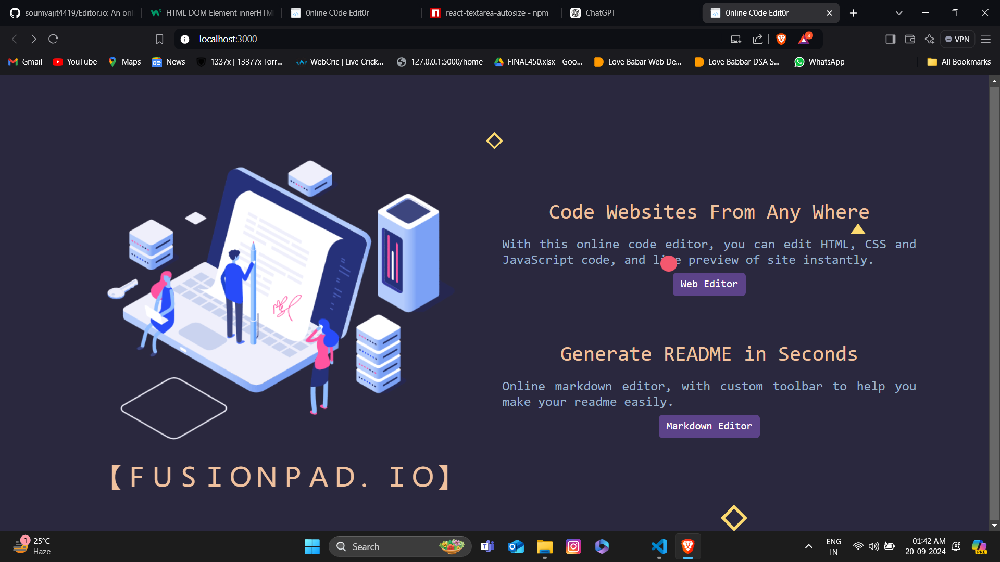
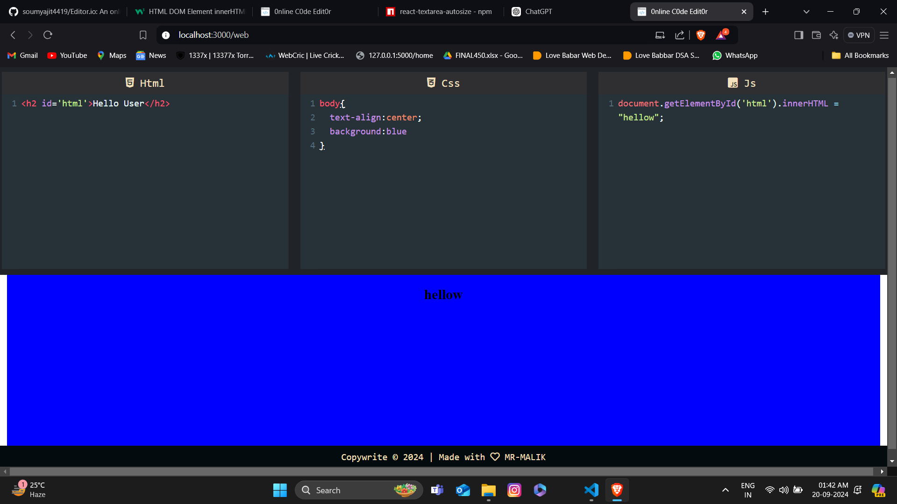
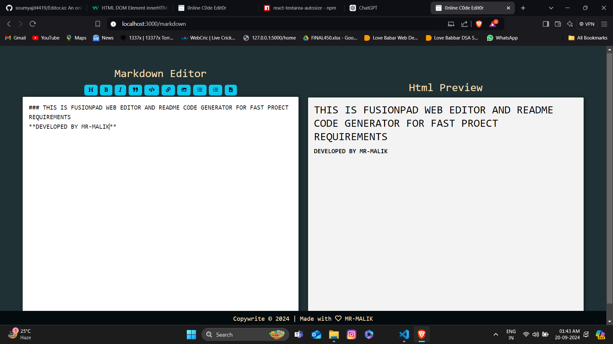

# FusionPad
## Your Ultimate Online Web Editor

## Overview

Welcome to **FusionPad**—the powerful web editor that combines the art of coding with the elegance of Markdown! Seamlessly craft HTML, CSS, and JavaScript projects while generating beautifully formatted README files from your Markdown content. With a suite of tools designed to enhance your editing experience, FusionPad makes web development a breeze.

---

## Screeshots

## Features

### Web Editor for HTML, CSS, and JavaScript

- **Intuitive Interface**: Navigate effortlessly through a clean and user-friendly design.
- **Live Preview**: Instantly see how your code transforms into a live web page.
- **Code Highlighting**: Enjoy syntax highlighting for improved readability.
- **Auto Save**: No worries about losing your progress; your work is saved automatically.
- **Tag and Bracket Autoclosing**: Write faster with automatic closing of HTML tags and brackets.
- **jQuery Support**: Easily integrate jQuery into your projects for enhanced functionality.

### Markdown Editor for README Generation

- **Markdown Tools**: Access a variety of tools to simplify your Markdown editing process.
- **Custom Toolbar**: Features like bold, italics, and links at your fingertips for easy formatting.
- **Live Markdown Preview**: Instantly see how your Markdown renders as formatted text.
- **Auto Save**: Your Markdown content is saved automatically, so you never lose a line of thought.
- **Download as README.md**: Effortlessly generate and download your README files for projects.

---

### Show Your Support

If you enjoy using FusionPad, please give us a ⭐ to show your support!

